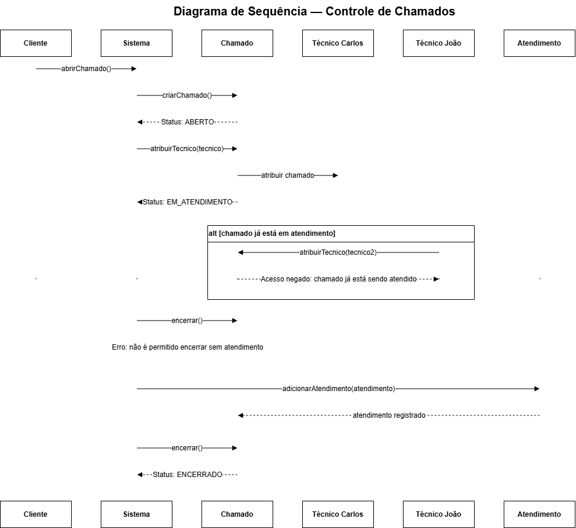

# Controle de Chamados

Sistema desenvolvido em Java para gerenciamento de chamados técnicos.

## Diagrama de Sequência

O diagrama abaixo representa o fluxo de atendimento de um chamado, incluindo o cenário alternativo em que um segundo técnico tenta assumir um chamado que já está em atendimento.

